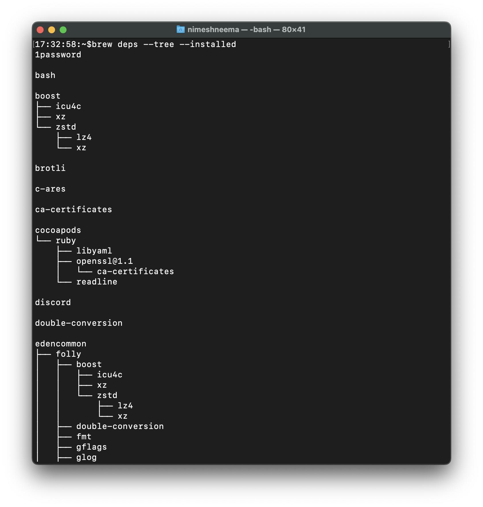

## Homebrew Tips and Tricks

To upgrade homebrew
$ brew update

To upgrade all installed casks
$ brew upgrade

`brew leaves` shows you all top-level packages; packages that are not dependencies. This should be the most interesting if you are using the list to re-install packages.

To include formula descriptions, use
~~~
brew leaves | xargs brew desc --eval-all
~~~
To include cask descriptions, use
~~~
brew ls --casks | xargs brew desc --eval-all
~~~

It is possible to view the list of all the installed packages as a nicely formatted dependency tree. To view it, execute the following command:

brew deps --tree --installed

An example output is as shown below:
```html

```


## Backing up and restoring brew installed files
creates Brewfile in the current directory from currently-installed packages
~~~
brew bundle dump
~~~

Install everything from the Brewfile
~~~
brew bundle
~~~